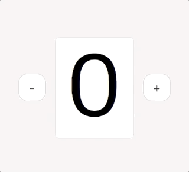
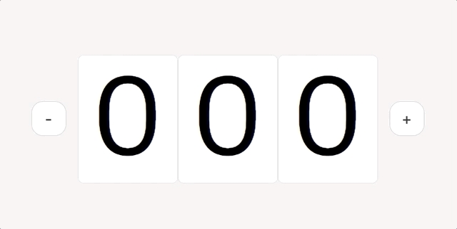

# FrontEnd TDD GYM
프론트엔드 개발에 TDD 적용하기 수업의 실습 예제 repo입니다.

[예제 미리보기](https://4spartame.github.io/fe-tdd-gym/static/)


## feature

| as is | to be |
| ----- | ----- |
|       |       |

| and more! |
| ----- |
|           |

## step

각 스텝의 진행은 브랜치로 분리되어 있습니다. 수업을 놓치더라도 현재 스텝의 브랜치로 이동해 실습을 진행하면 됩니다.

### `step1/characterize`

이미 작성되어있는 코드에 특성화 테스트(`characterization test`)를 진행해 봅니다.
아무리 코드가 마음에 들지 않아도 테스트를 전부 작성하기 전에는 프로덕션 코드에 손대지 마세요! 커버리지를 확보한 후 리팩토링을 진행합니다.

> 스펙 리스트
>
> - 버튼을 클릭하면 숫자가 증감하는 한자릿수 순환 카운터이다.
> - 화면에 아래의 html 요소가 추가되어야 한다.
>   - `div.counter`
>     - `button.minus`
>     - `button.plus`
>     - `div.number`
> - 카운터 박스에는 현재 카운터 숫자가 텍스트로 출력된다.
> - 마이너스 버튼을 누르면 숫자가 감소된다.
> - 플러스 버튼을 누르면 숫자가 증가한다.


### `step2/refactor`

TDD로 코드의 설계를 변경하고, 테스트 더블에 대해 알아봅니다.

> 추가 스펙 리스트
>
> - 숫자를 화면에 그리는 `Display` 컴포넌트를 작성한다.
> - 숫자가 변경되었을 때 `Display.update` 메서드를 호출한다

### `step3/feature`

TDD로 DOM 이벤트와 비동기 처리가 포함된 새로운 기능을 작성해 봅니다.

> 추가 스펙 리스트
>
> - 카운터의 숫자가 변경될 때 애니메이션된다.
> - 카운터가 애니메이션되는 도중 숫자가 변경되면 애니메이션이 종료된 뒤에 다음 애니메이션을 실행한다.


> 마크업 명세
>
> - `.number`요소의 하위에 `span.before`과 `span.after`를 삽입한다.
> - `span.before`에 이전 숫자를 삽입하고, `span.after`에 변경될 숫자를 삽입한다.
> - 숫자가 커지는 애니메이션을 재생시키려면 `.number`요소에 `.increase`클래스를 설정한다.
> - 숫자가 작아지는 애니메이션을 재생시키려면 `.number`요소에 `.decrease`클래스를 설정한다.

### and more!

수업 내용을 복습하면서 혼자서 TDD로 구현해 봅시다.

> 추가 스펙 리스트
>
> - 카운터 초기화시에 인자로 자릿수를 등록하면 해당 자릿수만큼의 숫자가 표시되어야 한다.
> - 카운터의 숫자 범위는 인자로 받은 자릿수를 벗어나지 않아야 한다.

## configuration

본 repo에 설정되어 있는 config에 대한 설명입니다. 이 항목은 수업에서 다루지 않으니 시간이 날 때 읽어보세요.

### package.json

- `devDependency`

  ```json
  "devDependencies": {
    "@babel/plugin-transform-modules-commonjs": "^7.6.0",
    "@types/jest": "^24.0.18",
    "babel-jest": "^24.9.0",
    "jest": "^24.9.0",
    "webpack": "^4.41.2",
    "webpack-dev-server": "^3.8.2"
  }
  ```

  - `jest` : 테스트를 구동하기 위한 `jest` 테스트 프레임워크 라이브러리입니다.
  - `@types/jest` : 실습에 `typescript`를 사용하지는 않지만 `@types/jest`를 설치하면 테스트 작성시에 vscode에서 자동으로 라이브러리 api의 명세를 제공하기 때문에 함께 설치합니다.
  - `babel-jest`, `@babel/plugin-transform-modules-commonjs` : 아래에서 설명합니다.
  - `live-server` : 현재 repo를 `root`로 하는 `http server`를 구동시켜주고, repo의 파일이 변경되면 자동으로 새로고침해주는 스크립트 라이브러리입니다.

- `scripts`
  ```json
  "scripts": {
    "test": "jest --watchAll --coverage --runInBand",
    "start": "webpack-dev-server -o static/main.js --contentBase=static --open --mode=development",
    "build": "webpack -o static/main.js --mode=production"
  }
  ```
  - `test` : `jest`를 구동하는 스크립트입니다. `npm run test` 명령어로 실행합니다.
    - `--watchAll` 옵션은 파일이 변경되면 자동으로 테스트를 재실행하는 옵션입니다.
    - `--coverage` 옵션은 실행된 테스트에 대한 커버리지를 계산하여 `<root>/coverage` 폴더에 커버리지 report 파일을 생성하는 옵션입니다.
    - `--runInBand` 옵션은 `jest`에서 실행하는 각 테스트가 비동기로 실행되는 대신 동기적으로 실행되도록 하는 옵션입니다. 테스트 구동 환경에 따라 해당 옵션이 성능 향상에 도움이 될 수도 있고, 오히려 성능을 하락시킬 수도 있습니다. 강의 실습에는 대부분 랩탑을 사용할 것을 상정하고 해당 옵션을 설정해두었습니다.
  - `start`: `webpack-dev-server`를 구동하는 스크립트입니다. `npm start` 명령어로 실행합니다. 서버가 실행되면 소스파일이 `./static/main.js`라는 단일 파일로 번들되어 임시 서버에 올라가게 됩니다.
    - `-o static/main.js` 옵션은 번들 파일을 저장할 디렉토리 패스입니다.
    - `--contentBase=static` 옵션은 서버의 기본 경로를 지정하기 위한 옵션입니다.
    - `--open` 옵션은 서버 실행시 자동으로 브라우저를 구동시키는 옵션입니다.
    - `--mode=development` 옵션은 소스를 개발 모드로 빌드하기 위한 플래그입니다.
  - `build`: `webpack`을 구동하는 스크립트입니다. `npm run build` 명령어로 실행합니다. 소스파일을 `./static/main.js`라는 단일 파일로 번들하여 저장합니다.
    - `-o static/main.js` 옵션은 번들 파일을 저장할 디렉토리 패스입니다.
    - `--mode=production` 옵션은 소스를 배포 모드로 빌드하기 위한 플래그입니다.

- `jest`

  ```json
  "jest": {
    "transform": {
      "^.+\\.js$": "babel-jest"
    },
    "roots": [
      "src"
    ]
  }
  ```

  - `transform` : `jest` 에서는 기본적으로 `es6 module` 방식의 `import`를 지원하지 않습니다. 그래서 `js`파일을 읽어들일 때 `babel`을 사용하도록 설정을 추가합니다.
  - `roots` : `jest`는 실행할 떄 자동으로 `.spec.js`나 `.test.js` 포맷의 파일을 읽어들여 테스트를 실행합니다. 이때 파일을 찾는 루트 경로를 지정합니다. `--watch` 모드에서는 파일이 변경되면 테스트가 재실행되는데, `roots` 옵션을 설정하면 해당 폴더 아래의 파일이 변경될 때만 재실행되게 됩니다.

- `babel`
  ```json
  "babel": {
    "plugins": [
      "@babel/plugin-transform-modules-commonjs"
    ]
  },
  ```
  - `plugins` : `es6 module` 형식의 `import`를 `commonjs` 형식의 `require`로 변환하는 설정입니다.
